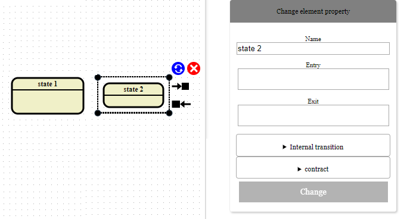
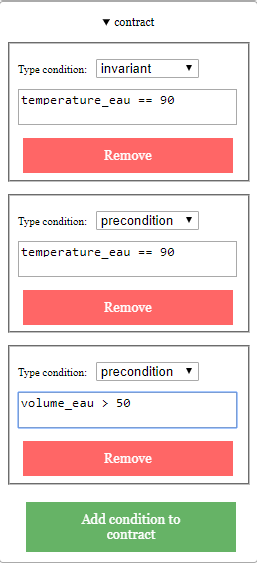
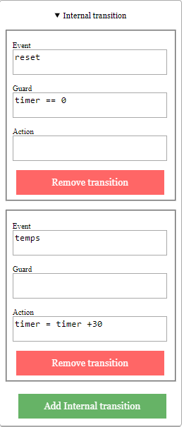
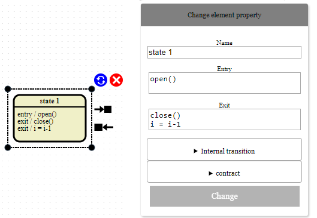
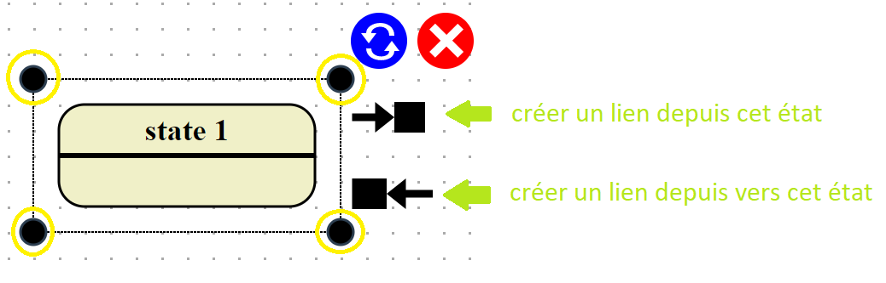
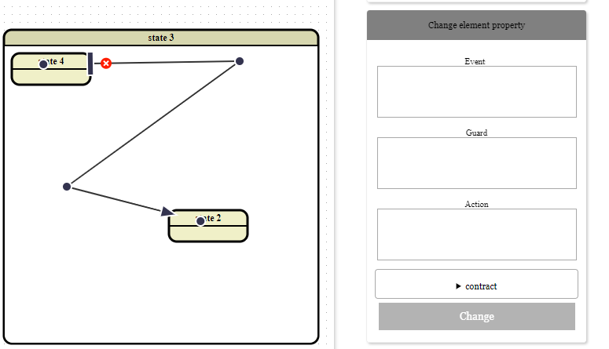
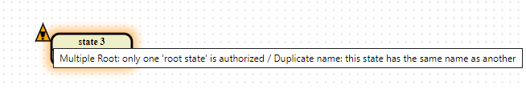

# Sismographe

Simographe est une application web permettant la création et l'édition de statecharts pouvant être exporté dans [Sismic](https://github.com/AlexandreDecan/sismic).
Celle-ci peut être exécutée en local. 
Pour commencer à utiliser l'application il faut d'abord l'installer en commençant par extraire les fichiers du paquet contenant l'application disponible sur la page github.
Une fois les fichiers extraits, il est nécessaire d'utiliser le gestionnaire de paquets npm avec la commande: "npm install" pour installer les dépendances nécessaires au fonctionnement de Sismographe.

&nbsp;

Une fois l'application installée, celle-ci peut être lancée à partir du fichier "index.html". 
Sismographe nécessite simplement d'avoir un navigateur moderne (Chrome, Firefox, Safari, Edge ou Opera) installé sur l'appareil pour pouvoir fonctionner.

Une fois lancé, l'affichage de la Figure ci-dessous apparaîtra.

Dans cet affichage nous pouvons voir les éléments suivants:
1. **Le menu de modifications des attributs du graphique:**
Les différentes jauges permettent de faire les actions suivantes (du haut vers le bas):
	* Déplacer l'origine sur les abscisses (axe des x).
	* Déplacer l'origine sur les ordonnées (axe des y).
	* Changer l'échelle sur les abscisses (axe des x).
	* Changer l'échelle sur les ordonnées (axe des y).
	* Changer la largeur visible du graphe.
	* Changer la longeur visible du graphe.
	* Changer la taille de la grille.
2. **Le menu de changement des propriétés du statechart:**
Celui-ci permet de changer le nom du statechart, ainsi que sa description et son préambule.
3. **Le menu de sauvegarde du statechart:**
Ce menu permet de sauvegarder le statechart actuel sous un format JSON.
Il permet aussi de charger des fichiers qui respectent la syntaxe de Sismographe.
4. **Le menu de création d'état:** Ce menu permet de créer les différents types d'états représentés par Sismographe.
La sélection d'un état composé créera un état comprenant déjà un état fils.
5. **La zone du graphe:** C'est dans cette zone que le graphe pourra être modifié. 
6. **La zone d'affichage des erreurs:** Cette zone liste les erreurs détectées dans le graphe en précisant la position de celles-ci.

&nbsp;

Une fois un état créé, celui-ci peut-être sélectionné. 
Quand un état est sélectionné, un menu permettant de changer son nom, ses entrées et ses sorties apparaît à droite.
L'utilisateur peut alors modifier ces différents éléments. 
Ceux-ci seront appliqués seulement si l'utilisateur appuie sur le bouton ``change".
Si le bouton ``change" n'est pas appuyé avant la désélection de l'état (si l'utilisateur appuie sur une partie quelconque du graphe) toutes les modifcations seront perdues.

L'utilisateur pourra aussi définir un contrat pour un état à l'aide de l'onglet prévu à cet effet visible dans l'exemple de la Figure ci-dessus.
Dans l'onglet "contract" l'utilisateur pourra ajouter ou supprimer des préconditions, postconditions ou invariants.
Les conditions définies dans le contrat n'apparaîteront pas visuellement dans le statechart mais seront exportées dans le fichier YAML.

&nbsp;

Si l'utilisateur sélectionne un état simple/composé/orthogonal il pourra alors définir/supprimer des transtions internes grâce à l'onglet prévu à cet effet, comme on peut le voir à la Figure ci-dessous.

Si l'utilisateur souhaite ajouter plusieurs actions d'entrée/de sortie, il doit faire un retour à la ligne entre chaque action d'entrée/de sortie.

Si un état est sélectionné, celui-ci peut-être redimensionné avec les points d'ancrage se trouvant dans les coins de l'outil de sélection (entouré en jaune dans la Figure ci-dessous).

&nbsp;

L'état et ses fils peuvent être supprimés en appuyant sur le bouton rouge surmonté d'une croix blanche. 
Un message de confirmation apparaîtra alors pour demander à l'utilisateur s'il souhaite bien supprimer l'état ainsi que tous ses fils et les transitions qui leur sont liées.

&nbsp;

Pour créer une transition entre deux états, l'utilisateur doit:
1. sélectionner l'état source.
2. appuyer sur le bouton permettant la création d'une transition depuis ou vers l'état sélectionné (selon le type de transitions que celui-ci décide de créer).
3. sélectionner l'état cible.
Une transition sera alors créée entre les deux états.

Une transition selectionnée par l'utilisateur, affiche différents outils pour pouvoir la modifier visuellement ou la supprimer (voir Figure ci-dessous).
Ces outils permettent de créer des points de passage, de modifier le point d'ancrage de la tête ou de la queue de la transition.

La sélection d'un lien fera apparaître un menu permettant de modifier l'événement, le guard, les actions et les conditions du contrat de cette transition.
Comme pour les états, l'utilisateur devra valider les modifications avant de déselectionner la transition, sous peine de perdre les changements effectués.  

Pour terminer, si une ou plusieurs erreurs sont détectées, l'état créant le ou les erreurs sera alors entouré d'un halo orange et il sera accompagné d'un triangle (voir exemple Figure ci-dessous).
Si le curseur est déplacé sur le triangle, un message contenant les différents problèmes créés par l'état apparaîtra.
Les erreurs détectées dans l'ensemble du graphe seront listées dans le cadre prévu à cet effet (le cadre 6 de la première Figure)

## Tester l'application maintenant?
Vous pouvez directement tester l'application sur cette page: https://pierre503.github.io/Sismographe/